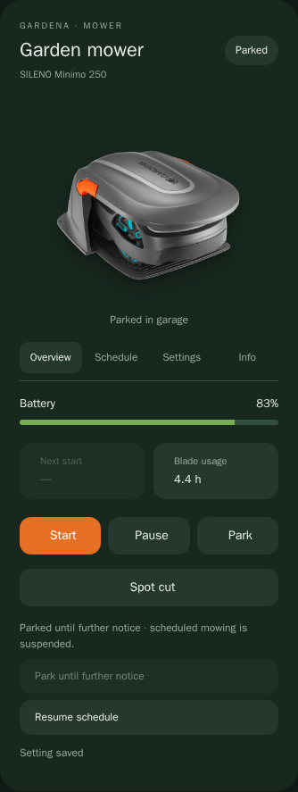

# Gardena Mower Card

A Home Assistant dashboard card for the [Gardena Mower BLE integration](https://github.com/AlirezaT/Gardena_Mower_BLE), with animated mower status, quick controls, inline settings and grouped diagnostics.



## Install with HACS

1. Install and configure the **Gardena Mower BLE** integration first.
2. In **HACS → ⋮ → Custom repositories**, add `https://github.com/AlirezaT/gardena-mower-card` with type **Dashboard** (called **Lovelace** or **Plugin** in some versions).
3. Find **Gardena Mower Card** in HACS and download it.
4. Reload your browser. HACS normally registers the dashboard resource automatically. If needed, add it under **Settings → Dashboards → Resources** as a **JavaScript module**:
   `/hacsfiles/gardena-mower-card/gardena-mower-card.js`
5. Add a **Manual** card to your dashboard:

```yaml
type: custom:gardena-mower-card
entity: lawn_mower.your_mower
name: Garden mower
```

This repository can be installed as a HACS custom repository. It is not currently included in the default HACS catalogue. The BLE integration and this card have separate installations and updates.

## Pages and controls

- **Overview:** battery, next start, blade usage, Start, Pause, Park, Spot Cut, Park until further notice and Resume schedule. Spot Cut becomes Stop spot cut when active.
- **Schedule:** weekly schedule stored on the mower, next start and a shortcut to Home Assistant's calendar editor. Automations are separate from the onboard schedule.
- **Settings:** direct switches and dropdowns, numeric inputs with Apply, lawn coverage and the mowing share around the station, plus starting-point settings.
- **Info:** status and safety, battery and charging, usage and maintenance, device details and historical messages. Includes Refresh diagnostics.

Optional controls appear only when their entities exist. Settings are discovered from the selected mower's device; they do not target other mowers. Start uses the integration's manual mowing duration. Resume schedule clears the permanent park override and may allow scheduled mowing. Station mowing share is read-only; use starting-point settings to adjust coverage.

Loading the card does not operate the mower. Commands are sent only when controls are used. Busy controls prevent duplicate requests and errors appear in the card. BLE response times depend on the integration and connection.

## Images and animations

Bundled scene photos show a SILENO Minimo and the garage accessory. Model names are discovered automatically; photos do **not** automatically change for every model. Supply your own images for another model. The integration determines which mower models and features are supported.

| Status | Animation |
| --- | --- |
| Parked | Stationary garage or docked photo |
| Charging | Same parked photo with an animated bolt |
| Mowing | Small forward/back movement and gentle turns, with scissors |
| Spot cutting | Rotation around the mower's right edge, with scissors |
| Returning | Reversed orientation, gentle movement and home icon |
| Paused | Stationary mower with pause icon |
| Error | Stationary mower with animated error icon |
| Unavailable | Muted stationary mower |

No GPS location is implied. Photos have softened edges and shadows. Built-in animations respect reduced-motion preferences.

```yaml
type: custom:gardena-mower-card
entity: lawn_mower.your_mower
name: Garden mower
# Otherwise follows the integration's Avoid Garage setting:
garage: true
animation: true
# Optional overrides; put personal photos in /config/www/mower/:
top_image: /local/mower/top.png
docked_image: /local/mower/docked.png
garage_image: /local/mower/garage.png
```

| Option | Meaning |
| --- | --- |
| `entity` | Required `lawn_mower` entity |
| `name` | Title; defaults to entity's friendly name |
| `model` | Override the displayed model name |
| `garage` | Force garage display on/off; otherwise follows `GarageEnabled` |
| `garage_entity` | Alternative entity whose `on` state means garage enabled |
| `animation` | Set `false` to disable built-in motion |
| `top_image` | Image for mowing, spot cutting, returning, paused and error |
| `image` | Fallback override for the top image |
| `docked_image` | Parked/charging photo without a garage |
| `garage_image` | Parked/charging photo with a garage |
| `status_icons` | Optional custom images keyed by `cut`, `pause`, `home`, `bolt`, `error` |
| `entities` | Override discovered integration entities |

Custom GIFs cannot be paused by the card's reduced-motion setting; use static images if needed. A broken photo falls back to the mower icon.

Entity overrides use the integration's descriptor keys, including case:

```yaml
entities:
  battery_level: sensor.your_mower_battery_level
  next_start_time: sensor.your_mower_next_start_time
  permanentPark: switch.your_mower_park_until_further_notice
  schedule: calendar.your_mower_schedule
  StartingPointChargingStationProportion: sensor.your_mower_charging_station_mowing_share
  "sensor:spotCutting": sensor.your_mower_spot_cutting
  "switch:spotCutting": switch.your_mower_spot_cut
```

## Upgrade from the local development card

Install through HACS, remove the old `/local/gardena-mower-card/gardena-mower-card-v*.js` resource, and change `type: custom:gardena-mower-card-v13` (or another development version) to `type: custom:gardena-mower-card`. Keep your other YAML settings and local image files. Reload the browser so only the new card definition is loaded.

## Manual installation

Download **all nine assets** from the latest release into `/config/www/gardena-mower-card/`, keeping them together. Register `/local/gardena-mower-card/gardena-mower-card.js` as a JavaScript module. Use the same card YAML as above. Do not install only the JavaScript file: CSS, photos and the home-animation player are separate files.

## Development and checks

Python 3 builds the flat `dist/` directory without a Node toolchain:

```sh
python3 scripts/build.py
python3 scripts/build.py --check
python3 -m pip install -r tests/requirements.txt
python3 -m playwright install --with-deps chromium
python3 tests/browser.py
```

The browser test serves only the release files, uses synthetic mower entities, and mocks all services. It checks animations/assets, entity discovery, inline settings, spot cut, availability, mobile layout and clicks during telemetry updates. It never connects to a real mower or Home Assistant.

For an interactive demo, run `python3 -m http.server 8000` in the repository and open `http://localhost:8000/tests/preview.html`.

Edit `src/` and rebuild `dist/`; commit both. Update `package.json` and `CHANGELOG.md` for releases. CI checks that the distribution is reproducible, runs browser tests, and validates the repository using HACS. `scripts/publish.sh` creates/pushes the repository and publishes the versioned release with all assets, using an authenticated GitHub CLI.

Original card code is MIT licensed. Product photos, the Lordicon home animation, and the Lottie player retain their respective notices; see [THIRD_PARTY_NOTICES.md](THIRD_PARTY_NOTICES.md). Photo attribution does not grant a separate general-purpose image license.
